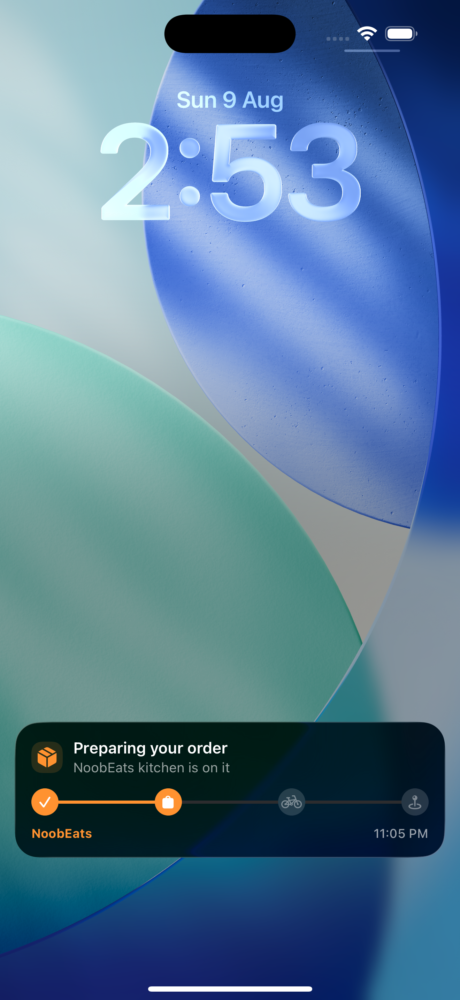
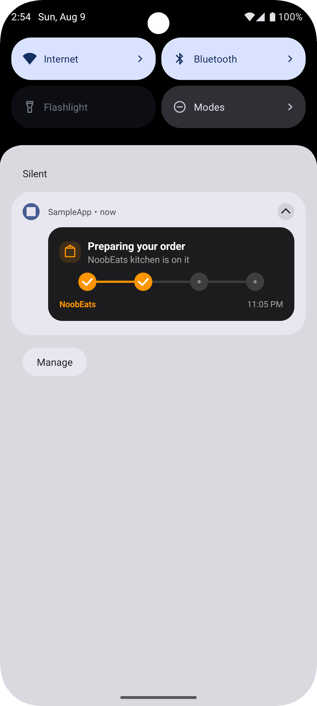
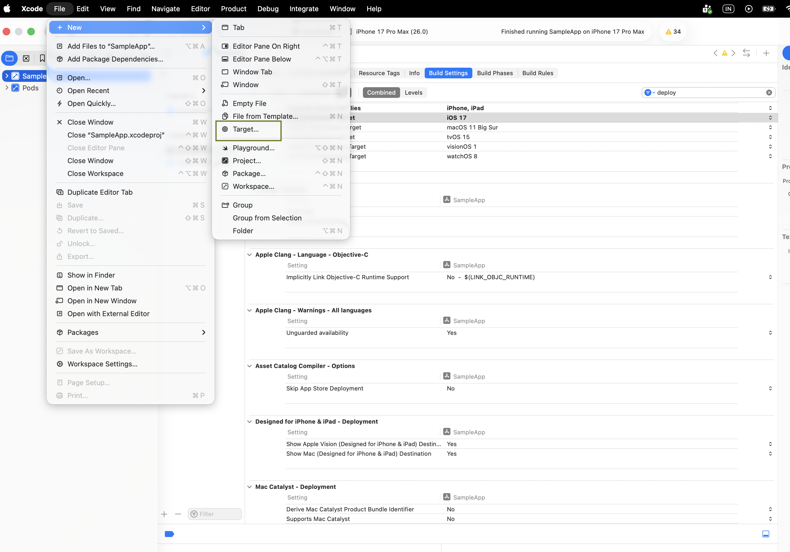
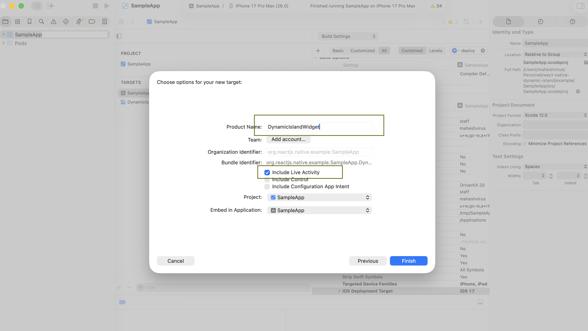
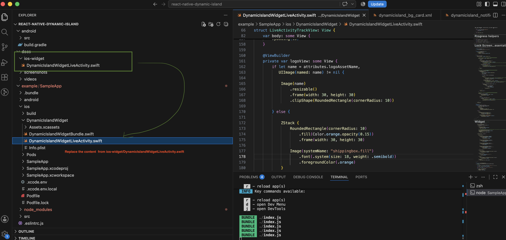
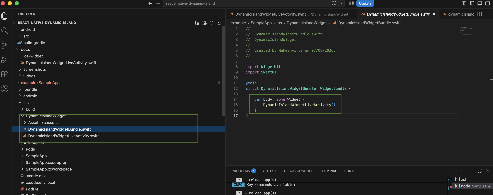

# @noobdigital/react-native-dynamic-island

[](https://www.npmjs.com/package/@noobdigital/react-native-dynamic-island)
[](https://www.npmjs.com/package/@noobdigital/react-native-dynamic-island)
[](./LICENSE)
[](#platform-behavior-summary)

Live-updating activity cards for React Native — **Live Activities / Dynamic
Island** on iOS, an **ongoing lock-screen notification** on Android. One JS
API, two native implementations, both styled to match.

Built for real-time order tracking, ride status, delivery ETAs, or any
"stays on the lock screen and updates in place" use case.

## 📱 iOS Preview

<p align="center">
  
</p>

---

## 🤖 Android Preview

<p align="center">
  
</p>

## 🎥 Live Demo (iOS & Android)

<p align="center">
  <video width="260" autoplay loop muted playsinline>
    <source src="docs/videos/Android_live_demo.webm" type="video/webm">
  </video>
  &nbsp;&nbsp;&nbsp;
  <video width="260" autoplay loop muted playsinline>
    <source src="docs/videos/Ios_live_demo.webm" type="video/webm">
  </video>
</p>

---

## Table of contents

- [Why this package](#why-this-package)
- [Install](#install)
- [Quick start](#quick-start)
- [iOS setup (required)](#ios-setup-required)
- [Android setup](#android-setup)
- [Usage](#usage)
- [API reference](#api-reference)
- [Content state fields](#content-state-fields)
- [Attributes (branding config)](#attributes-branding-config)
- [Deep linking](#deep-linking)
- [Custom step icons](#custom-step-icons)
- [Custom brand logo](#custom-brand-logo)
- [Platform behavior summary](#platform-behavior-summary)
- [Troubleshooting](#troubleshooting)
- [TypeScript](#typescript)
- [Example app](#example-app)
- [Contributing](#contributing)
- [License](#license)

---

## Why this package

"Dynamic Island" the *visual element* — the pill-shaped cutout animation —
is iPhone 14 Pro+ hardware and OS specific. No Android device has it, and no
software package can add it. What this library gives you on Android instead
is the closest real equivalent production apps actually ship for the same
job: a persistent, in-place-updating notification that survives the lock
screen and can't be swiped away while active. Same use case (live order
tracking, ride status, delivery ETAs), different visual language per
platform — but **the JS API and content shape are identical on both**, so
you write your tracking logic once.

- 🏝 Real ActivityKit Live Activity + Dynamic Island on iOS 16.2+
- 🔔 Ongoing, updating notification on Android — zero manual native setup required
- 🎨 Branded out of the box — logo, brand name, and step icons all configurable from JS
- 🔗 Deep linking — tapping the card/notification opens your app at a specific screen
- 📦 Classic `NativeModules` bridge, no TurboModule/JSI — maximum RN version compatibility
- 🧩 One `startActivity` / `updateActivity` / `endActivity` API for both platforms

---

## Install

```sh
npm install @noobdigital/react-native-dynamic-island
cd ios && pod install
```

---

## Quick start

```ts
import {
  startActivity,
  updateActivity,
  endActivity,
} from '@noobdigital/react-native-dynamic-island';

await startActivity(
  {
    title: 'Order confirmed',
    status: 'Order #4821 · 3 items',
    eta: '11:20 PM',
    progress: '10',
    deepLink: 'yourapp://order-tracking/4821',
  },
  {
    brandName: 'NoobEats',
    stepIcons: ['checkmark', 'bag.fill', 'bicycle', 'mappin.and.ellipse'],
    logoAssetName: 'noobeats_logo', // optional
  }
);

// later, as the order progresses
await updateActivity({
  title: 'Arriving now',
  status: 'Your rider is almost there',
  eta: '10:56 PM',
  progress: '90',
  deepLink: 'yourapp://order-tracking/4821',
});

// when it's done
await endActivity();
```

iOS needs one manual Xcode step before this will render anything (see
below) — Android works immediately with no native setup required.

---

## iOS setup (required)

ActivityKit will not render anything — no lock screen card, no Dynamic
Island — unless your app has a **Widget Extension target**. This is an
Apple platform requirement, not something an npm install can add for you.
It's a one-time step per project.

### 1. Add a Widget Extension target

In Xcode: **File → New → Target → Widget Extension**. Name it something
like `DynamicIslandWidget`. Check **"Include Live Activity"** when prompted.

<p align="center">

</p>

### 2. Set the deployment target correctly


Your **Widget Extension target's** iOS Deployment Target must be **less
than or equal to** your main app target's deployment target (and to
whatever device/simulator OS you test on). A common mistake is leaving the
extension at whatever Xcode defaulted it to — check **Target →
Build Settings → iOS Deployment Target** on both targets and align them
(iOS 16.2 minimum, since that's the ActivityKit API floor used by this
library).

<p align="center">

</p>

### 3. Replace the generated widget file

Delete the placeholder Swift file Xcode generated inside your new target
and replace it with [`ios-widget/DynamicIslandWidgetLiveActivity.swift`](./ios-widget/DynamicIslandWidgetLiveActivity.swift)
from this repo. Keep your target's own `DynamicIslandWidgetBundle.swift`
(the `@main` entry point) — don't duplicate `@main` across two files, that
will fail to compile.

<p align="center">

</p>

<p align="center">

</p>


### 4. Enable Live Activities in your main app's Info.plist

In your **main app target's** `Info.plist` (not the extension's):

```xml
<key>NSSupportsLiveActivities</key>
<true/>
```

### 5. Confirm the extension is embedded

**Main app target → General → Frameworks, Libraries, and Embedded
Content** — confirm `DynamicIslandWidgetExtension.appex` is listed there
("Embed Without Signing" for Debug, signed normally for Release).

### 6. Build once

Build the app once end-to-end to confirm the extension compiles and is
embedded. If the lock screen card doesn't appear after that, see
[Troubleshooting](#troubleshooting) below — there's a short, ordered list of
the actual causes we've hit in production, most of which are easy to miss.

---

## Android setup

**Nothing to configure by default.** All layouts, drawables, and the
notification channel are shipped inside the library itself and merge
automatically into your app via Gradle — the same mechanism any Android SDK
uses to ship resources without asking you to create files.

### Runtime notification permission (Android 13+)

Android 13+ requires the user to grant notification permission at runtime —
a manifest entry alone isn't enough. Request it once, e.g. on app start or
right before your first `startActivity` call:

```ts
import { PermissionsAndroid, Platform } from 'react-native';

if (Platform.OS === 'android' && Platform.Version >= 33) {
  await PermissionsAndroid.request(
    PermissionsAndroid.PERMISSIONS.POST_NOTIFICATIONS
  );
}
```

If permission is denied, `startActivity` / `updateActivity` reject with
`PERMISSION_DENIED` — handle that in your JS rather than assuming success.
`areActivitiesEnabled()` reflects this too (resolves `false` if
notifications are disabled for the app).

---

## Usage

Same shape on both platforms — build a small state machine for your
tracking stages and call `updateActivity` as your backend pushes changes:

```ts
import {
  areActivitiesEnabled,
  startActivity,
  updateActivity,
  endActivity,
  type DynamicIslandContentState,
  type DynamicIslandAttributes,
} from '@noobdigital/react-native-dynamic-island';

const DEEP_LINK = 'yourapp://order-tracking/4821';

const BRAND: DynamicIslandAttributes = {
  brandName: 'NoobEats',
  stepIcons: ['checkmark', 'bag.fill', 'bicycle', 'mappin.and.ellipse'],
  logoAssetName: 'noobeats_logo', // optional — see Custom brand logo
};

const STAGES: DynamicIslandContentState[] = [
  { title: 'Order confirmed', status: 'Order #4821 · 3 items', eta: '11:20 PM', progress: '10', deepLink: DEEP_LINK },
  { title: 'Preparing your order', status: 'NoobEats kitchen is on it', eta: '11:05 PM', progress: '35', deepLink: DEEP_LINK },
  { title: 'Rider picked up your order', status: 'On the way to you', eta: '10:58 PM', progress: '65', deepLink: DEEP_LINK },
  { title: 'Arriving now', status: 'Your rider is almost there', eta: '10:56 PM', progress: '90', deepLink: DEEP_LINK },
  { title: 'Delivered', status: 'Enjoy your meal! 🎉', eta: '10:55 PM', progress: '100', deepLink: DEEP_LINK },
];

async function trackOrder() {
  if (!(await areActivitiesEnabled())) return;

  await startActivity(STAGES[0], BRAND);

  for (let i = 1; i < STAGES.length; i++) {
    await new Promise((r) => setTimeout(r, 4000));
    await updateActivity(STAGES[i]); // attributes are NOT resent on update
  }

  await endActivity();
}
```

> **Note:** `attributes` (`brandName`, `stepIcons`, `logoAssetName`) is set
> once in `startActivity` and stays fixed for the activity's lifetime.
> `updateActivity` only takes `content` — passing `attributes` there is a
> no-op and not part of the type signature.

---

## API reference

| Method | Returns | Notes |
|---|---|---|
| `areActivitiesEnabled()` | `Promise<boolean>` | iOS: OS version + user's Live Activities setting. Android: whether notifications are enabled for the app. |
| `startActivity(content, attributes?)` | `Promise<string>` | Resolves with the activity/notification id. Only one activity runs at a time — calling this again replaces the previous one. `attributes` is optional; omit it for an unbranded default. |
| `updateActivity(content)` | `Promise<boolean>` | Updates the running activity's content. Rejects `NO_ACTIVITY` if nothing is running — call `startActivity` first. |
| `endActivity()` | `Promise<boolean>` | Ends the running activity, if any. Safe to call with nothing running. |

---

## Content state fields

`content` is a flat `Record<string, string>`, sent on every `startActivity`
and `updateActivity` call.

| Key | Required | Description |
|---|---|---|
| `title` | recommended | Bold headline — what's happening right now (e.g. `"Arriving now"`). |
| `status` | recommended | Supporting detail line, rendered smaller/dimmer (e.g. `"Your rider is almost there"`). |
| `eta` | optional | Shown in the footer, right-aligned. |
| `progress` | optional | `"0"`–`"100"` as a string. Drives the step track and any progress bar. |
| `deepLink` | optional | URL opened when the user taps the card/notification. See [Deep linking](#deep-linking). Must be included on **every** stage — it is not preserved across `updateActivity` calls, since each call fully replaces the content state. |

Any other keys are passed through to native but only read on iOS if your
widget UI is customized to look for them.

---

## Attributes (branding config)

`attributes` is passed once, only to `startActivity` — it's fixed for the
activity's entire lifetime, unlike `content` which changes on every update.

| Key | Platform | Description |
|---|---|---|
| `brandName` | both | Shown in the brand/footer row. Defaults to `"App"` if omitted. |
| `stepIcons` | iOS (also sets step *count* on Android) | Array of [SF Symbol](https://developer.apple.com/sf-symbols/) names, in stage order, driving the progress track UI. Defaults to a 4-step set (`checkmark`, `bag.fill`, `bicycle`, `mappin.and.ellipse`) if omitted. |
| `androidStepIcons` | Android only | Optional array of Android drawable resource names, in stage order, overriding the generic dot/checkmark track with your own icons. See [Custom step icons](#custom-step-icons). |
| `logoAssetName` | both | Name of your brand logo asset. See [Custom brand logo](#custom-brand-logo) for the one-time setup this requires per platform. Falls back to a neutral placeholder box if omitted or not found — never falls back to your app's launcher icon. |

---

## Deep linking

Tapping the Live Activity / notification can open your app at a specific
screen.

**Include `deepLink` in every stage**, not just the first — each
`updateActivity` call fully replaces the content state, so a `deepLink`
set only on `STAGES[0]` is gone after the first update.

```ts
{ title: 'Arriving now', status: '...', eta: '...', progress: '90', deepLink: 'yourapp://order-tracking/4821' }
```

**iOS** — requires your `AppDelegate` to forward the URL to React Native's
Linking module:

```swift
func application(
  _ app: UIApplication,
  open url: URL,
  options: [UIApplication.OpenURLOptionsKey: Any] = [:]
) -> Bool {
  return RCTLinkingManager.application(app, open: url, options: options)
}
```

If your app uses the `UIScene` lifecycle instead, add the equivalent to
your `SceneDelegate`'s `scene(_:openURLContexts:)`.

**Both platforms** — handle cold start (app was killed) as well as warm
start, since `Linking`'s `'url'` event alone won't fire retroactively for a
URL that arrived before your listener was attached:

```ts
useEffect(() => {
  Linking.getInitialURL().then((url) => {
    if (url) handleDeepLink(url); // cold start
  });
  const sub = Linking.addEventListener('url', ({ url }) => {
    handleDeepLink(url); // warm / background start
  });
  return () => sub.remove();
}, []);
```

If you're using React Navigation's `linking` prop on `NavigationContainer`,
this is handled for you automatically.

---

## Custom step icons

**iOS** uses SF Symbol names directly — any name from the [SF Symbols
app](https://developer.apple.com/sf-symbols/) works:

```ts
stepIcons: ['checkmark', 'bag.fill', 'bicycle', 'mappin.and.ellipse']
```

**Android** has no SF Symbols equivalent, so `stepIcons` only determines
step *count* there by default, rendering a generic dot/checkmark track. To
use your own icons per step on Android, add drawable resources to your
**host app's** `res/drawable` and reference them by name:

```ts
{
  stepIcons: ['checkmark', 'bag.fill', 'bicycle', 'mappin.and.ellipse'], // iOS
  androidStepIcons: ['ic_step_confirmed', 'ic_step_preparing', 'ic_step_rider', 'ic_step_arrived'], // Android
}
```

Falls back gracefully to the generic dot/checkmark track if
`androidStepIcons` is omitted or a name isn't found.

---

## Custom brand logo

A widget extension (iOS) and your host app's resources (Android) can't read
each other's assets automatically — each requires a one-time manual step.

### iOS

1. Open your Widget Extension's own `Assets.xcassets` (not the main app's).
2. Add a new **Image Set**, named exactly what you'll pass as
   `logoAssetName` (case-sensitive).
3. Provide @2x / @3x images — a 40×40pt mark works well.

```ts
logoAssetName: 'BrandLogo'
```

<p align="center">

</p>


### Android

1. Add your logo to your **host app's** `res/drawable` (or density-specific
   `drawable-mdpi` / `-hdpi` / `-xhdpi` / `-xxhdpi` folders). Easiest via
   Android Studio: right-click `res` → **New → Image Asset**.
2. Reference it by filename, without extension:

```ts
logoAssetName: 'noobeats_logo'
```

Rebuild the native app after adding the asset on either platform — a
Metro/JS reload alone won't pick up new native resources.

If `logoAssetName` is omitted or not found on either platform, the card
shows a neutral orange-tinted placeholder box — never your app's launcher
icon, so an unbranded integration doesn't imply a brand that isn't actually
configured.

---

## Platform behavior summary

| | iOS | Android |
|---|---|---|
| Minimum OS | 16.2 | 6.0 (API 23) |
| Visual | Real Live Activity + Dynamic Island (ActivityKit) | Ongoing, updating lock-screen notification |
| Native setup required | Yes — Widget Extension target (one-time, see [iOS setup](#ios-setup-required)) | No — resources ship inside the library |
| Runtime permission | None beyond the user's Live Activities setting | `POST_NOTIFICATIONS` on Android 13+ |
| Below minimum OS | `areActivitiesEnabled()` resolves `false`; other calls reject `UNSUPPORTED_OS` | N/A — works on all supported API levels |
| Custom step icons | SF Symbol names | Optional drawable resources (`androidStepIcons`), falls back to generic dots |
| Custom logo | Widget Extension's own asset catalog | Host app's `res/drawable` |

---

## Troubleshooting

**Activity is created (resolves an id, no error) but nothing renders on
iOS.** Check, in order:
1. Widget Extension's iOS Deployment Target is ≤ your app target's and ≤
   the OS version you're testing on.
2. `NSSupportsLiveActivities` is `true` in the **main app's** Info.plist.
3. Simulator/device: **Settings app → search "Live Activities"** — confirm
   the toggle is on, and check the per-app toggle under your app's own
   settings page (only appears after the app has requested an activity at
   least once).
4. `DynamicIslandWidgetExtension.appex` is listed under your app target's
   **Frameworks, Libraries, and Embedded Content**.
5. If you recently changed deployment targets or Info.plist keys, do a full
   clean: `xcrun simctl uninstall booted <bundle-id>`, delete DerivedData
   for the project, rebuild from Xcode directly (not just Metro/CLI).

**`Invalid redeclaration of 'DynamicIslandWidgetBundle'`.** You have `@main`
declared in two files. Keep exactly one `WidgetBundle` with `@main` in your
extension target.

**Android: card shows but content looks squeezed to one side.** This is
OEM notification chrome (most visible on Samsung OneUI), not your layout —
some OEM skins reserve a fixed-width zone on the notification's edge for
their own affordances. It's expected platform variance, not a bug in this
library.

**Deep link doesn't fire on cold start (works after warm start).** Make
sure `deepLink` is included in **every** stage's content, not just the
first (`updateActivity` fully replaces state), and that you're calling
`Linking.getInitialURL()` on mount, not just listening for the `'url'`
event.

**CMake / Kotlin compile errors unrelated to this package** (e.g.
`add_subdirectory given source ... which is not an existing directory` for
an unrelated module like `async-storage`) — this is a stale New Architecture
codegen artifact, not caused by this library. Clean and reinstall:
`rm -rf node_modules android/app/.cxx android/app/build && npm install`.

---

## TypeScript

Fully typed. Key exports:

```ts
export type DynamicIslandContentState = Record<string, string>;

export interface DynamicIslandAttributes {
  brandName: string;
  stepIcons?: string[];
  androidStepIcons?: string[];
  logoAssetName?: string;
}
```

---

## Example app

A full working demo (order-tracking simulation, permission handling, deep
linking) lives in [`/example`](./example) — run it with:

```sh
cd example
npm install
cd ios && pod install && cd ..
npm run ios     # or: npm run android
```

---

## Contributing

Issues and PRs welcome. Please include repro steps and, for native issues,
your RN version, iOS/Android OS version, and whether New Architecture is
enabled.

## License

MIT © [NoobDigital](https://github.com/NoobDigital)